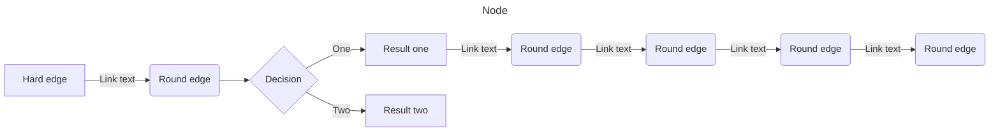

---
tags:
  - worknote
excerpt: 
status: inprogress
destination: Projects/
---

### Question List
```dataviewjs
dv.taskList(
dv.current().file.tasks
    .where(t => (t.text.includes("?") |t.text.includes("？")) && !t.completed),false)
```
### Task List
```dataviewjs
dv.taskList(
dv.current().file.tasks
    .where(t => !t.text.includes("?") && !t.text.includes("？") && !t.completed),false)
```

### Logging


